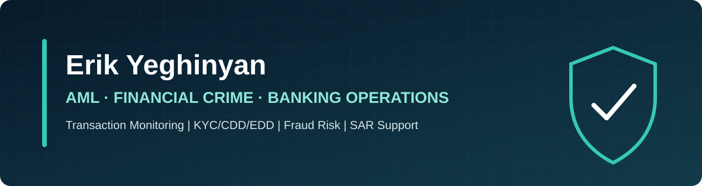
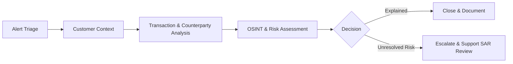

  

  
  
  

## Professional Profile

Financial crime investigations professional with **2+ years of experience** across fintech platforms, management consulting, and frontline banking. I investigate transaction-monitoring alerts involving ACH, P2P, account takeover, unusual spending, and fraud—then turn complex activity into clear, risk-based decisions.

My experience connects three perspectives: first-line customer and transaction controls at Santander Bank, high-volume investigations for Green Dot Bank through Guidehouse, and digital onboarding and compliance operations at IDBank.

## Recruiter Snapshot

| 30+ | 25% | 30% | 3 |
|:---:|:---:|:---:|:---:|
| Daily investigations | Efficiency improvement | Fewer false-positive escalations | Languages |
| **Unit21 & World-Check** | **AML/BSA & OFAC** | **KYC/CDD/EDD** | **ACH, P2P & ATO** |

## Selected Work

| Work sample | Skills demonstrated |
|---|---|
| **[Transaction-Monitoring Investigation →](case-studies/transaction-monitoring-case-study.md)** | Alert triage, transaction analysis, risk indicators, investigative judgment, escalation |
| **[KYC/CDD/EDD Workflow →](workflows/kyc-cdd-edd-workflow.md)** | Customer identification, risk rating, screening, enhanced review, ongoing monitoring |
| **[Payments & Fraud Typologies →](research/payments-fraud-typologies.md)** | ACH, P2P, account takeover, mule activity, synthetic identity, bank–fintech comparison |
| **[SAR-Style Narrative →](samples/sample-sar-style-narrative.md)** | Objective, chronological, concise, and evidence-based investigative writing |

## Investigation Lifecycle

## Core Expertise

## Experience

### Santander Bank — Teller / Relationship Banker
*Massachusetts · September 2025–May 2026*

First-line-of-defense experience applying KYC/CIP controls, recognizing unusual activity and fraud indicators, gathering transaction context, protecting customer information, and escalating concerns to the appropriate specialist teams.

### Guidehouse | Green Dot Bank — AML Compliance Analyst
*Vilnius, Lithuania (Hybrid) · September 2024–September 2025*

Completed 30+ daily alert investigations in Unit21 across ACH, P2P, account takeover, unusual spending, and fraud. Managed cases from triage through pattern analysis, documentation, adjudication, escalation, and resolution; synthesized KYC, OSINT, adverse-media, and transaction data into decision-ready findings and SAR narrative support.

### IDBank — Compliance Operations Specialist
*Yerevan, Armenia (Remote) · September 2023–September 2024*

Reviewed customer onboarding and account activity using KYC, CDD, EDD, CIP, identity verification, document analysis, source-of-funds context, OSINT, and fraud indicators. Resolved inconsistencies and escalated cases requiring enhanced review.

## Tools & Communication

| Investigation tools | Data & productivity | Languages |
|---|---|---|
| Unit21, World-Check, case-management systems, OSINT, adverse media | Excel: PivotTables, XLOOKUP, Power Query; Google Workspace; Microsoft Office | Armenian: Native; English: C2; Russian: B2 |

## Education & Credentials

**LCC International University** — B.A. Communication, GPA 3.8/4.0 (2024)

- Foundations in AML/KYC
- Banking & Insurance AML/KYC
- Crypto Financial Crime Bootcamp
- Leveraging AI for GRC — PMI (April 2025)
- GDPR Training

> **My approach:** Effective AML work is not about treating every unusual transaction as suspicious. It is about understanding expected behavior, following the flow of funds, testing reasonable explanations, documenting evidence, and escalating risk with clarity.

---

<strong>Confidentiality:</strong> Every case, customer profile, account number, transaction, and narrative in this repository is fictional and created solely for educational and portfolio purposes. Nothing here contains customer information, confidential employer material, internal procedures, or an actual Suspicious Activity Report. This material is not legal or regulatory advice.
